# Case 1: The Server That Doesn't Exist

## 🎯 Objective

Demonstrate how to expose a local web service to the internet without having a public IP, using reverse SSH tunnels.

## 📋 Concept

Web server accessible from the internet that is physically on your local machine, without a public IP.

## 🔧 SSH Techniques Demonstrated

- **Remote Port Forwarding** (`ssh -R`): Reverse tunnel from local machine to public server
- **Web server with netcat**: Using the [crazy-bat](https://github.com/antoniollv/crazy-bat) project

## 🏗️ Architecture

**Port Configuration:**

- **Local Machine Port:** 8085 (where crazy-bat web server runs)
- **EC2 Public Port:** 8080 (exposed to the internet)
- **SSH Tunnel Mapping:** EC2:8080 → localhost:8085

1. **Local Machine**
   - Runs crazy-bat (web server with netcat on port 8085)
   - Initiates reverse SSH tunnel to EC2

2. **AWS EC2**
   - t2.micro instance with public IP
   - Receives SSH connection from local machine
   - Exposes port 8080 to internet
   - Security Group: allows traffic on port 8080

3. **Audience**
   - Accesses `http://<ec2-public-ip>:8080`
   - Sees content served from presenter's local machine

```mermaid
graph LR
    A[👥 Internet] -->|HTTP :8080| B[☁️ AWS EC2<br/>Public IP]
    B -.->|SSH Reverse<br/>Tunnel| C[💻 Local Machine<br/>crazy-bat :8085]
    C -.->|Establishes tunnel<br/>-R 8080:localhost:8085| B
    
    style A fill:#e1f5ff,stroke:#01579b,stroke-width:2px
    style B fill:#fff3e0,stroke:#e65100,stroke-width:2px
    style C fill:#f3e5f5,stroke:#4a148c,stroke-width:2px
```



## 🚀 Demonstration

### 1. Preparation on Local Machine

Clone the [crazy-bat](https://github.com/antoniollv/crazy-bat.git) repository and start the service

The script `./02-reverse-tunnel/setup-crazy-bat.sh` performs these steps

**Verify it works locally:**

```bash
curl http://localhost:8085
```

### 2. Deploy AWS Infrastructure

Via **GitHub Actions**

```text
Go to Actions → "02 - Reverse Tunnel Infrastructure" → Run workflow
```

Or manually with **Terraform**

```bash
cd 02-reverse-tunnel/terraform
terraform init
terraform apply
```

**Resources created:**

- EC2 t2.micro with public IP
- Security Group (SSH port 22, HTTP port 8080)
- Elastic IP (optional for static IP)

### 4. Live Presentation

**Show the audience:**

1. **Public access:** Share URL `http://<ec2-public-ip>:8080`
2. **Local verification:** Show that crazy-bat is running on `localhost:8085`
3. **Active tunnel:** `sudo systemctl status reverse-tunnel.service`

### 5. Technical Explanations

- **How does `-R 8080:localhost:8085` work?**
  - The EC2 server listens on its port 8080
  - When someone connects, SSH redirects traffic to port 8085 on the local machine
  
- **Why the `-N` flag?**
  - Prevents execution of remote commands
  - Doesn't open interactive shell
  - The process only maintains the tunnel (cleaner and more secure)

## 🎬 Demonstration Recording

[](https://asciinema.org/a/9erIgP1kRfFykP1whloRglkQq)

The recording shows all state transitions:

- ❌ **Local service**: Not running → ✅ Running (crazy-bat container)
- ❌ **Remote access**: Not accessible → ✅ Accessible (reverse SSH tunnel)
- 🔄 Complete setup and cleanup cycle

## 📦 Required Resources

### AWS

- **EC2 Instance:** t2.micro (Free Tier eligible)
- **Security Group:**
  - Inbound: Port 22 (SSH from your IP)
  - Inbound: Port 8080 (HTTP from 0.0.0.0/0)
- **Key Pair:** For SSH authentication

### Local

- **crazy-bat:** [https://github.com/antoniollv/crazy-bat](https://github.com/antoniollv/crazy-bat)
- **SSH client:** OpenSSH
- **netcat** [https://netcat.sourceforge.net/](https://netcat.sourceforge.net/)
- **Docker** [https://www.docker.com/](https://www.docker.com/) (Optional)

## 📝 Presenter Notes

- **Estimated time:** 12 minutes
- **Prerequisites verified before demo:**
  - ✅ AWS infrastructure deployed
  - ✅ crazy-bat running locally
  - ✅ SSH tunnel active and verified
  - ✅ Public URL shared with audience
- **Backup plan:** Asciinema recording ready to play if live demo fails
