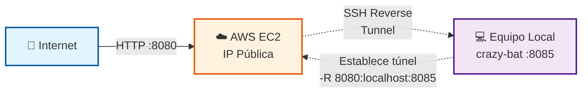

# Caso 1: El Servidor que No Existe

## 🎯 Objetivo

Demostrar cómo exponer un servicio web local a internet sin tener IP pública, usando túneles SSH inversos.

## 📋 Concepto

Servidor web accesible desde internet que físicamente está en tu equipo local, sin IP pública.

## 🔧 Técnicas SSH Demostradas

- **Remote Port Forwarding** (`ssh -R`): Túnel inverso desde equipo local hacia servidor público
- **Servidor web con netcat**: Uso del proyecto [crazy-bat](https://github.com/antoniollv/crazy-bat)

## 🏗️ Arquitectura

**Configuración de Puertos:**

- **Puerto Equipo Local:** 8085 (donde se ejecuta el servidor web crazy-bat)
- **Puerto Público EC2:** 8080 (expuesto a internet)
- **Mapeo del Túnel SSH:** EC2:8080 → localhost:8085

1. **Equipo Local**
   - Ejecuta crazy-bat (servidor web con netcat en puerto 8085)
   - Inicia túnel SSH inverso hacia EC2

2. **AWS EC2**
   - Instancia t2.micro con IP pública
   - Recibe conexión SSH desde equipo local
   - Expone puerto 8080 a internet
   - Security Group: permite tráfico en puerto 8080

3. **Audiencia**
   - Accede a `http://<ec2-public-ip>:8080`
   - Ve el contenido servido desde el equipo local del presentador



## 🚀 Demostración

### 1. Preparación en el equipo local

Clonar el repositorio [crazy-bat](https://github.com/antoniollv/crazy-bat.git) e iniciar el servicio

El  script .`/02-reverse-tunnel/setup-crazy-bat.sh` que realiza estos pasos

**Verificar que funciona localmente:**

```bash
curl http://localhost:8085
```

### 2. Desplegar Infraestructura AWS

Via **GitHub Actions**

```text
Go to Actions → "02 - Reverse Tunnel Infrastructure" → Run workflow
```

O manualmente con **Terraform**

```bash
cd 02-reverse-tunnel/terraform
terraform init
terraform apply
```

**Recursos creados:**

- EC2 t2.micro con IP pública
- Security Group (SSH puerto 22, HTTP puerto 8080)
- Elastic IP (opcional para IP estática)

### 4. Presentación en Vivo

**Mostrar a la audiencia:**

1. **Acceso público:** Compartir URL `http://<ec2-public-ip>:8080`
2. **Verificación local:** Mostrar que crazy-bat está corriendo en `localhost:8085`
3. **Túnel activo:** `sudo systemctl status reverse-tunnel.service`

### 5. Explicaciones Técnicas

- **¿Cómo funciona `-R 8080:localhost:8085`?**
  - El servidor EC2 escucha en su puerto 8080
  - Cuando alguien se conecta, SSH redirige el tráfico al puerto 8085 del equipo local
  
- **¿Por qué el flag `-N`?**
  - Evita la ejecución de comandos remotos
  - No abre shell interactiva
  - El proceso solo mantiene el túnel (más limpio y seguro)  

## 🎬 Grabación de la demostración

[](https://asciinema.org/a/9erIgP1kRfFykP1whloRglkQq)

La grabación muestra todas las transiciones de estado:

- ❌ **Servicio local**: No ejecutándose → ✅ Ejecutándose (contenedor crazy-bat)
- ❌ **Acceso remoto**: No accesible → ✅ Accesible (túnel SSH inverso)
- 🔄 Ciclo completo de configuración y limpieza

## 📦 Recursos Necesarios

### AWS

- **EC2 Instance:** t2.micro (Free Tier elegible)
- **Security Group:**
  - Inbound: Puerto 22 (SSH desde tu IP)
  - Inbound: Puerto 8080 (HTTP desde 0.0.0.0/0)
- **Key Pair:** Para autenticación SSH

### Local

- **crazy-bat:** [https://github.com/antoniollv/crazy-bat](https://github.com/antoniollv/crazy-bat)
- **SSH client:** OpenSSH
- **netcat** [https://netcat.sourceforge.net/](https://netcat.sourceforge.net/)
- **Docker** [https://www.docker.com/](https://www.docker.com/) (Opcional)

## 📝 Notas para el Presentador

- **Tiempo estimado:** 12 minutos
- **Prerequisitos verificados antes de la demo:**
  - ✅ Infraestructura AWS desplegada
  - ✅ crazy-bat funcionando localmente
  - ✅ Túnel SSH activo y verificado
  - ✅ URL pública compartida con la audiencia
- **Backup plan:** Grabación asciinema lista para reproducir si falla la demo en vivo
