# Case 2: The Tunnel to the Hidden Treasure

## 🎯 Objective

Demonstrate how to access an RDS database in a private subnet from a local client (DBeaver) using an SSH tunnel through a bastion host.

## 📋 Concept

MariaDB database in AWS without direct public access, accessible only via SSH tunnel from your local machine through a bastion server.

## 🔧 SSH Techniques Demonstrated

- **Local Port Forwarding** (`ssh -L`): Tunnel from local machine to remote service
- **Bastion Host**: Intermediate server for secure access to private resources
- **Database Tunneling**: Access databases without exposing them to the internet

## 🏗️ Architecture

1. **Local Machine**
   - Runs SQL client (DBeaver, mysql client)
   - Establishes SSH tunnel to bastion
   - Connects to `localhost:3306` (mapped to RDS)

2. **AWS EC2 Bastion**
   - t2.micro instance with public IP
   - Receives SSH connection from local machine
   - Acts as bridge to RDS in private subnet

3. **AWS RDS MariaDB**
   - db.t3.micro instance in private subnet
   - **No public IP** (maximum security)
   - Only accepts connections from bastion
   - Contains sample data (employees, products)

```mermaid
graph LR
    A[💻 Local Machine<br/>DBeaver] -->|SSH Tunnel<br/>-L 3306:RDS:3306| B[☁️ EC2 Bastion<br/>Public IP]
    B -->|MySQL :3306| C[🗄️ RDS MariaDB<br/>Private Subnet]
    
    A -.->|Connects to<br/>localhost:3306| A
    
    style A fill:#e1f5ff,stroke:#01579b,stroke-width:2px
    style B fill:#fff3e0,stroke:#e65100,stroke-width:2px
    style C fill:#f3e5f5,stroke:#4a148c,stroke-width:2px
```



## 🚀 Demonstration

### 1. Deploy AWS Infrastructure

Via **GitHub Actions**

```text
Go to Actions → "Deploy Case 2 - Database SSH Tunnel Infrastructure" → Run workflow
```

Or manually with **Terraform**

```bash
cd 03-proxyjump-forwarding/terraform
terraform init
terraform apply
```

**Resources created:**

- VPC with 1 public subnet and 2 private subnets
- EC2 t2.micro (bastion) with Elastic IP
- RDS MariaDB db.t3.micro in private subnet
- Security Groups (bastion allows SSH, RDS only from bastion)
- Database populated with sample data

### 2. Retrieve Credentials

Credentials are stored in **AWS Secrets Manager** for enhanced security.

**Option 1: From AWS Console:**

1. Go to AWS Console → Secrets Manager
2. Search for secret: `ssh-tips/case02-database-credentials`
3. Click "Retrieve secret value"
4. Copy values: bastion_public_ip, db_username, db_password, rds_address

**Option 2: From AWS CLI:**

```bash
aws secretsmanager get-secret-value \
  --secret-id ssh-tips/case02-database-credentials \
  --region eu-west-1 \
  --query SecretString --output text | jq
```

**Example output:**

```json
{
  "bastion_public_ip": "34.254.xxx.xxx",
  "rds_endpoint": "ssh-tips-mariadb.xxxxxx.eu-west-1.rds.amazonaws.com:3306",
  "rds_address": "ssh-tips-mariadb.xxxxxx.eu-west-1.rds.amazonaws.com",
  "db_name": "demodb",
  "db_username": "admin",
  "db_password": "xxxxxxxxxxxxxxxx",
  "db_port": 3306,
  "ssh_user": "ec2-user"
}
```

### 3. Configure Credentials Locally

```bash
cd 03-proxyjump-forwarding

# Copy template
cp env.local.template env.local

# Edit env.local with values from Secrets Manager
nano env.local
```

### 4. Establish SSH Tunnel

**Command:**

```bash
ssh -i ~/.ssh/id_rsa \
    -L 3306:<RDS_ADDRESS>:3306 \
    -N \
    ec2-user@<BASTION_PUBLIC_IP>
```

**Flags explained:**

- `-L 3306:<RDS_ADDRESS>:3306`: Maps local port 3306 to RDS port 3306
- `-N`: Doesn't execute remote commands (tunnel only)
- `-i ~/.ssh/id_rsa`: SSH private key

**The tunnel remains active in the foreground. Keep this terminal open.**

### 5. Connect with DBeaver

With the tunnel active in another terminal:

1. Open DBeaver
2. New connection → MariaDB/MySQL
3. Configure:
   - **Host:** `127.0.0.1` (localhost)
   - **Port:** `3306`
   - **Database:** `demodb`
   - **Username:** `admin` (from Secrets Manager)
   - **Password:** `<db_password>` (from Secrets Manager)
4. Test Connection → ✅ Success
5. Explore tables: `employees`, `products`

### 6. Example Queries

```sql
-- View products
SELECT * FROM products LIMIT 10;

-- View employees by department
SELECT name, department, salary 
FROM employees 
ORDER BY salary DESC 
LIMIT 5;

-- Statistics
SELECT department, COUNT(*) as total, AVG(salary) as avg_salary
FROM employees
GROUP BY department;
```

### 7. Live Presentation

**Demonstration of complete flow:**

1. **Without tunnel:** Try connecting directly to RDS → ❌ FAILS
2. **Establish tunnel:** Execute SSH command
3. **With tunnel:** Connect DBeaver to localhost → ✅ SUCCESS
4. **Show data:** Execute queries live
5. **Close tunnel:** Ctrl+C in SSH terminal
6. **Without tunnel again:** Try connecting → ❌ FAILS

### 8. Technical Explanations

- **Why the SSH tunnel?**
  - RDS in private subnet has no public IP (security)
  - Bastion is the only entry point with public IP
  - The tunnel creates a secure encrypted "bridge"

- **How does `-L 3306:rds-address:3306` work?**
  - SSH listens on your local port 3306
  - All traffic is sent to the bastion
  - Bastion forwards to RDS port 3306
  - Your local application thinks the DB is on localhost

- **Why not give RDS a public IP?**
  - Principle of least privilege
  - Reduces attack surface
  - Compliance with regulations (GDPR, PCI-DSS)
  - Controlled access only from bastion

## 🎬 Demonstration Recording

**[▶️ Watch the complete automated demonstration (5-7 min)](asciinema-url-pending)**

The recording shows all state transitions:

- ❌ **Direct connection to RDS**: Not accessible (private subnet)
- 🔒 **SSH tunnel established**: Creating secure bridge
- ✅ **Connection via tunnel**: Successful database access
- 📊 **Example queries**: Querying employees and products tables
- 🛑 **Tunnel closed**: Connection drops immediately
- ❌ **Without tunnel**: Not accessible again

## 📦 Required Resources

### AWS

- **VPC:** 1 public subnet + 2 private subnets (multi-AZ)
- **EC2 Bastion:** t2.micro (Free Tier eligible)
- **RDS MariaDB:** db.t3.micro (20GB storage)
- **Security Groups:**
  - Bastion SG: Port 22 (SSH from your IP)
  - RDS SG: Port 3306 (MySQL only from Bastion SG)
- **Elastic IP:** For static bastion IP
- **Secrets Manager:** Secure credentials storage

### Local

- **SSH client:** OpenSSH
- **SQL Client:** DBeaver, MySQL Workbench, or mysql CLI
- **AWS CLI:** To retrieve credentials (optional)
- **jq:** To parse JSON from Secrets Manager (optional)

### Sample Data (pre-loaded)

**Table employees (10 records):**

- Fields: id, name, department, salary, hire_date
- Departments: Engineering, Marketing, Sales, HR

**Table products (10 records):**

- Fields: id, name, category, price, stock
- Categories: Electronics, Office, Stationery

## 📝 Presenter Notes

- **Estimated time:** 12 minutes
- **Prerequisites verified before demo:**
  - ✅ AWS infrastructure deployed
  - ✅ Credentials retrieved from Secrets Manager
  - ✅ DBeaver installed and configured
  - ✅ SSH key accessible
  - ✅ SSH tunnel command prepared
  - ✅ SQL example queries ready to copy/paste

- **Backup plan:** Asciinema recording ready to play if live demo fails

- **Presentation tips:**
  - Have the SSH command in a text file for quick copy
  - Prepare DBeaver with configuration ready (without saved password)
  - Show the error without tunnel first (visual impact)
  - Highlight query speed (low latency even with tunnel)

## ⚠️ Troubleshooting

### Cannot connect to bastion

```bash
# Verify bastion is running
aws ec2 describe-instances \
  --filters "Name=tag:Name,Values=ssh-tips-bastion" \
  --query 'Reservations[0].Instances[0].State.Name'

# Verify Security Group allows your IP
# Add your current IP if it changed
```

### Tunnel disconnects

```bash
# Add keepalive to SSH command
ssh -i ~/.ssh/id_rsa \
    -L 3306:<RDS_ADDRESS>:3306 \
    -N \
    -o ServerAliveInterval=60 \
    -o ServerAliveCountMax=3 \
    ec2-user@<BASTION_PUBLIC_IP>
```

### DBeaver won't connect to localhost

```bash
# Verify tunnel is active
netstat -an | grep 3306

# Should show:
# tcp        0      0 127.0.0.1:3306          0.0.0.0:*               LISTEN
```

### RDS is unreachable from bastion

```bash
# Connect to bastion and test connectivity
ssh -i ~/.ssh/id_rsa ec2-user@<BASTION_PUBLIC_IP>

# Inside bastion
mysql -h <RDS_ADDRESS> -u admin -p

# If it fails, verify RDS Security Group
```

## 🔗 References

- [SSH Local Port Forwarding](https://www.ssh.com/academy/ssh/tunneling/example)
- [DBeaver Documentation](https://dbeaver.io/docs/)
- [AWS RDS Security Best Practices](https://docs.aws.amazon.com/AmazonRDS/latest/UserGuide/CHAP_BestPractices.Security.html)
- [Bastion Host Architecture](https://aws.amazon.com/solutions/implementations/linux-bastion/)

## 🧹 Resource Cleanup

**Important:** Destroy infrastructure after demo to avoid costs.

Via **GitHub Actions:**

```text
Go to Actions → "Deploy Case 2" → Run workflow
Action: destroy
```

Or manually:

```bash
cd 03-proxyjump-forwarding/terraform
terraform destroy -auto-approve
```

**Note:** The GitHub Actions workflow automatically deletes the Secrets Manager secret when running `destroy`.
