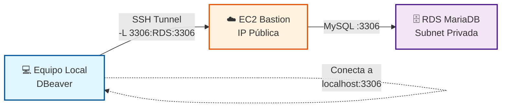

# Caso 2: El Túnel al Tesoro Escondido

## 🎯 Objetivo

Demostrar cómo acceder a una base de datos RDS en subnet privada desde un cliente local (DBeaver) mediante un túnel SSH a través de un bastion host.

## 📋 Concepto

Base de datos MariaDB en AWS sin acceso público directo, accesible únicamente mediante túnel SSH desde tu equipo local a través de un servidor bastion.

## 🔧 Técnicas SSH Demostradas

- **Local Port Forwarding** (`ssh -L`): Túnel desde equipo local hacia servicio remoto
- **Bastion Host**: Servidor intermedio para acceso seguro a recursos privados
- **Database Tunneling**: Acceso a bases de datos sin exponerlas a internet

## 🏗️ Arquitectura

1. **Equipo Local**
   - Ejecuta cliente SQL (DBeaver, mysql client)
   - Establece túnel SSH hacia bastion
   - Conecta a `localhost:3306` (mapeado a RDS)

2. **AWS EC2 Bastion**
   - Instancia t2.micro con IP pública
   - Recibe conexión SSH desde equipo local
   - Actúa como puente hacia RDS en subnet privada

3. **AWS RDS MariaDB**
   - Instancia db.t3.micro en subnet privada
   - **Sin IP pública** (máxima seguridad)
   - Solo acepta conexiones desde bastion
   - Contiene datos de ejemplo (employees, products)



## 🚀 Demostración

### 1. Desplegar Infraestructura AWS

Via **GitHub Actions**

```text
Go to Actions → "Deploy Case 2 - Database SSH Tunnel Infrastructure" → Run workflow
```

O manualmente con **Terraform**

```bash
cd 03-proxyjump-forwarding/terraform
terraform init
terraform apply
```

**Recursos creados:**

- VPC con 1 subnet pública y 2 subnets privadas
- EC2 t2.micro (bastion) con IP elástica
- RDS MariaDB db.t3.micro en subnet privada
- Security Groups (bastion permite SSH, RDS solo desde bastion)
- Base de datos poblada con datos de ejemplo

### 2. Recuperar Credenciales

Las credenciales se almacenan en **AWS Secrets Manager** para mayor seguridad.

**Opción 1: Desde AWS Console:**

1. Ir a AWS Console → Secrets Manager
2. Buscar secret: `ssh-tips/case02-database-credentials`
3. Click "Retrieve secret value"
4. Copiar valores: bastion_public_ip, db_username, db_password, rds_address

**Opción 2: Desde AWS CLI:**

```bash
aws secretsmanager get-secret-value \
  --secret-id ssh-tips/case02-database-credentials \
  --region eu-west-1 \
  --query SecretString --output text | jq
```

**Salida ejemplo:**

```json
{
  "bastion_public_ip": "34.254.xxx.xxx",
  "rds_endpoint": "ssh-tips-mariadb.xxxxxx.eu-west-1.rds.amazonaws.com:3306",
  "rds_address": "ssh-tips-mariadb.xxxxxx.eu-west-1.rds.amazonaws.com",
  "db_name": "demodb",
  "db_username": "admin",
  "db_password": "xxxxxxxxxxxxxxxx",
  "db_port": 3306,
  "ssh_user": "ec2-user"
}
```

### 3. Configurar Credenciales Localmente

```bash
cd 03-proxyjump-forwarding

# Copiar template
cp env.local.template env.local

# Editar env.local con valores del Secrets Manager
nano env.local
```

### 4. Establecer Túnel SSH

**Comando:**

```bash
ssh -i ~/.ssh/id_rsa \
    -L 3306:<RDS_ADDRESS>:3306 \
    -N \
    ec2-user@<BASTION_PUBLIC_IP>
```

**Flags explicados:**

- `-L 3306:<RDS_ADDRESS>:3306`: Mapea puerto local 3306 al puerto 3306 de RDS
- `-N`: No ejecuta comandos remotos (solo túnel)
- `-i ~/.ssh/id_rsa`: Clave SSH privada

**El túnel se mantiene activo en primer plano. Dejar esta terminal abierta.**

### 5. Conectar con DBeaver

Con el túnel activo en otra terminal:

1. Abrir DBeaver
2. Nueva conexión → MariaDB/MySQL
3. Configurar:
   - **Host:** `127.0.0.1` (localhost)
   - **Port:** `3306`
   - **Database:** `demodb`
   - **Username:** `admin` (del Secrets Manager)
   - **Password:** `<db_password>` (del Secrets Manager)
4. Test Connection → ✅ Success
5. Explorar tablas: `employees`, `products`

### 6. Queries de Ejemplo

```sql
-- Ver productos
SELECT * FROM products LIMIT 10;

-- Ver empleados por departamento
SELECT name, department, salary 
FROM employees 
ORDER BY salary DESC 
LIMIT 5;

-- Estadísticas
SELECT department, COUNT(*) as total, AVG(salary) as avg_salary
FROM employees
GROUP BY department;
```

### 7. Presentación en Vivo

**Demostración del flujo completo:**

1. **Sin túnel:** Intentar conectar directamente a RDS → ❌ FALLA
2. **Establecer túnel:** Ejecutar comando SSH
3. **Con túnel:** Conectar DBeaver a localhost → ✅ ÉXITO
4. **Mostrar datos:** Ejecutar queries en vivo
5. **Cerrar túnel:** Ctrl+C en terminal SSH
6. **Sin túnel otra vez:** Intentar conectar → ❌ FALLA

### 8. Explicaciones Técnicas

- **¿Por qué el túnel SSH?**
  - RDS en subnet privada no tiene IP pública (seguridad)
  - Bastion es el único punto de entrada con IP pública
  - El túnel crea un "puente seguro" cifrado

- **¿Cómo funciona `-L 3306:rds-address:3306`?**
  - SSH escucha en tu puerto local 3306
  - Todo el tráfico se envía al bastion
  - Bastion reenvía al puerto 3306 de RDS
  - Tu aplicación local cree que la BD está en localhost

- **¿Por qué no dar IP pública a RDS?**
  - Principio de mínimo privilegio
  - Reduce superficie de ataque
  - Cumplimiento de normativas (GDPR, PCI-DSS)
  - Acceso controlado solo desde bastion

## 🎬 Grabación de la demostración

[](https://asciinema.org/a/9wCUOTTsDSStF1muhBecx4GQC)

**[▶️ Ver la demostración completa automatizada](https://asciinema.org/a/9wCUOTTsDSStF1muhBecx4GQC)**

La grabación muestra todas las transiciones de estado:

- ❌ **Conexión directa a RDS**: No accesible (private subnet)
- 🔒 **Túnel SSH establecido**: Creando puente seguro
- ✅ **Conexión vía túnel**: Acceso exitoso a base de datos
- 📊 **Queries de ejemplo**: Consultando tablas employees y products
- 🛑 **Túnel cerrado**: Conexión cae inmediatamente
- ❌ **Conexión sin túnel**: No accesible de nuevo

## 📦 Recursos Necesarios

### AWS

- **VPC:** 1 subnet pública + 2 subnets privadas (multi-AZ)
- **EC2 Bastion:** t2.micro (Free Tier elegible)
- **RDS MariaDB:** db.t3.micro (20GB storage)
- **Security Groups:**
  - Bastion SG: Puerto 22 (SSH desde tu IP)
  - RDS SG: Puerto 3306 (MySQL solo desde Bastion SG)
- **Elastic IP:** Para IP estática del bastion
- **Secrets Manager:** Almacenamiento seguro de credenciales

### Local

- **SSH client:** OpenSSH
- **Cliente SQL:** DBeaver, MySQL Workbench, o mysql CLI
- **AWS CLI:** Para recuperar credenciales (opcional)
- **jq:** Para parsear JSON de Secrets Manager (opcional)

### Datos de Ejemplo (pre-cargados)

**Tabla employees (10 registros):**

- Campos: id, name, department, salary, hire_date
- Departamentos: Engineering, Marketing, Sales, HR

**Tabla products (10 registros):**

- Campos: id, name, category, price, stock
- Categorías: Electronics, Office, Stationery

## 📝 Notas para el Presentador

- **Tiempo estimado:** 12 minutos
- **Prerequisitos verificados antes de la demo:**
  - ✅ Infraestructura AWS desplegada
  - ✅ Credenciales recuperadas de Secrets Manager
  - ✅ DBeaver instalado y configurado
  - ✅ Clave SSH accesible
  - ✅ Comando SSH del túnel preparado
  - ✅ Queries SQL de ejemplo listos para copiar/pegar

- **Backup plan:** Grabación asciinema lista para reproducir si falla la demo en vivo

- **Tips para la presentación:**
  - Tener el comando SSH en un archivo de texto para copiar rápido
  - Preparar DBeaver con la configuración lista (sin guardar password)
  - Mostrar primero el error sin túnel (impacto visual)
  - Resaltar la velocidad de las queries (baja latencia incluso con túnel)

## ⚠️ Troubleshooting

### No puedo conectar al bastion

```bash
# Verificar que el bastion está corriendo
aws ec2 describe-instances \
  --filters "Name=tag:Name,Values=ssh-tips-bastion" \
  --query 'Reservations[0].Instances[0].State.Name'

# Verificar Security Group permite tu IP
# Añadir tu IP actual si cambió
```

### El túnel se desconecta

```bash
# Añadir keepalive al comando SSH
ssh -i ~/.ssh/id_rsa \
    -L 3306:<RDS_ADDRESS>:3306 \
    -N \
    -o ServerAliveInterval=60 \
    -o ServerAliveCountMax=3 \
    ec2-user@<BASTION_PUBLIC_IP>
```

### DBeaver no conecta a localhost

```bash
# Verificar que el túnel está activo
netstat -an | grep 3306

# Debe mostrar:
# tcp        0      0 127.0.0.1:3306          0.0.0.0:*               LISTEN
```

### RDS está inaccesible desde bastion

```bash
# Conectar al bastion y probar conectividad
ssh -i ~/.ssh/id_rsa ec2-user@<BASTION_PUBLIC_IP>

# Dentro del bastion
mysql -h <RDS_ADDRESS> -u admin -p

# Si falla, verificar Security Group de RDS
```

## 🔗 Referencias

- [SSH Local Port Forwarding](https://www.ssh.com/academy/ssh/tunneling/example)
- [DBeaver Documentation](https://dbeaver.io/docs/)
- [AWS RDS Security Best Practices](https://docs.aws.amazon.com/AmazonRDS/latest/UserGuide/CHAP_BestPractices.Security.html)
- [Bastion Host Architecture](https://aws.amazon.com/solutions/implementations/linux-bastion/)

## 🧹 Limpieza de Recursos

**Importante:** Destruir la infraestructura después de la demo para evitar costos.

Via **GitHub Actions:**

```text
Go to Actions → "Deploy Case 2" → Run workflow
Action: destroy
```

O manualmente:

```bash
cd 03-proxyjump-forwarding/terraform
terraform destroy -auto-approve
```

**Nota:** El workflow de GitHub Actions elimina automáticamente el secret de Secrets Manager al ejecutar `destroy`.
