# Case 3: The Invisible Desktop

## 🎯 Objective

Demonstrate how to run graphical applications remotely and display them on your local machine using X11 forwarding over SSH.

## 📋 Concept

Execute GUI applications on a remote AWS EC2 instance while viewing and interacting with them on your local screen, without VNC or RDP.

## 🔧 SSH Techniques Demonstrated

- **X11 Forwarding** (`ssh -X`): Display remote graphical applications locally
- **Trusted X11** (`ssh -Y`): Enhanced X11 forwarding with full trust
- **Cross-platform compatibility**: Works on Linux, Windows, and macOS

## 🏗️ Architecture

1. **Local Machine**
   - Runs X11 server (X.Org on Linux, VcXsrv on Windows, XQuartz on macOS)
   - Connects to EC2 with X11 forwarding enabled
   - Displays remote application windows locally

2. **AWS EC2 Instance**
   - t2.micro with Amazon Linux 2023
   - X11 libraries and applications installed
   - SSH configured with X11Forwarding enabled
   - Runs GUI applications that appear on client screen

```mermaid
graph LR
    A[💻 Local Machine<br/>X11 Server] -->|SSH -X<br/>Encrypted Tunnel| B[☁️ EC2 Instance<br/>X11 Apps]
    B -.->|X11 Protocol<br/>GUI Commands| A
    A -->|Display| C[🖥️ Your Screen<br/>Remote Windows]
    
    style A fill:#e1f5ff,stroke:#01579b,stroke-width:2px
    style B fill:#fff3e0,stroke:#e65100,stroke-width:2px
    style C fill:#f3e5f5,stroke:#4a148c,stroke-width:2px
```



## 🚀 Demonstration

### 1. Deploy AWS Infrastructure

Go to GitHub Actions and run the **Deploy Case 3 - X11 Forwarding Infrastructure** workflow:

- **Environment**: `poc`
- **Action**: `apply`
- **AWS Region**: `eu-west-1` (or your preferred region)
- **SSH Public Key**: Your public SSH key content

The workflow will:

- ✅ Create VPC with public subnet
- ✅ Deploy EC2 instance with X11 packages
- ✅ Configure SSH for X11 forwarding
- ✅ Install demo applications (xeyes, xterm)
- ✅ Display connection instructions

### 2. Setup Local X11 Server

#### Linux

No action needed - X11 server is already running.

#### Windows

**Option 1: VcXsrv (Recommended)**

```powershell
# Download and install VcXsrv
# https://sourceforge.net/projects/vcxsrv/

# Launch XLaunch with these settings:
# - Display settings: Multiple windows
# - Start no client
# - Extra settings: Disable access control ✓

# Set DISPLAY variable in PowerShell
$env:DISPLAY="localhost:0.0"
```

**Option 2: MobaXterm (Easiest)**

```text
1. Download MobaXterm: https://mobaxterm.mobatek.net/
2. Built-in X11 server activates automatically
3. Create SSH session with X11-Forwarding enabled
```

#### macOS

```bash
# Install XQuartz
brew install --cask xquartz

# Log out and log back in
# XQuartz must be running before SSH connection
```

### 3. Connect with X11 Forwarding

```bash
# Replace with your EC2 IP and SSH key path
ssh -X -i ~/.ssh/your-key.pem ec2-user@<EC2_PUBLIC_IP>
```

**For trusted X11 (more permissive):**

```bash
ssh -Y -i ~/.ssh/your-key.pem ec2-user@<EC2_PUBLIC_IP>
```

### 4. Test X11 Forwarding

#### Simple Test (30 seconds)

```bash
# Eyes that follow your cursor
xeyes
```

**Expected**: A window with eyes appears on your local screen, following your mouse movements.

#### X11 Terminal (Main Demo)

```bash
# X11 terminal - run any command with graphical output
xterm

# Inside xterm, you can:
ls /etc
cat /home/ec2-user/welcome.txt
top  # monitor system resources
```

**Expected**: Terminal window opens on your local screen. Commands run on **remote EC2**, showing remote filesystem. You can open multiple xterm windows simultaneously.

**All running on EC2, displayed on your screen!**

### 5. How It Works


## 🎬 Demonstration Recording

[](https://asciinema.org/a/PLACEHOLDER)

**[▶️ Watch the complete automated demonstration](https://asciinema.org/a/PLACEHOLDER)**

The recording shows:

- 🔒 **SSH connection with -X flag**: Establishing X11 tunnel
- 👀 **xeyes demo**: Simple visual test
- 💻 **xterm demo**: Remote terminal with graphical interface
- ✅ **All windows appear locally**: While running remotely

## 📦 Required Resources

**AWS:**

- 1× VPC (10.0.0.0/16)
- 1× Public Subnet
- 1× Internet Gateway
- 1× EC2 t2.micro (Amazon Linux 2023)
- 1× Elastic IP
- 1× Security Group (SSH:22)

**Estimated cost:** ~$0.012/hour (~$0.10 for 8-hour demo day)

## 🔒 Security Considerations

### X11 Forwarding vs X11 Trusted

**`ssh -X` (Safer)**

- Uses X11 Security Extension
- Restricts what remote apps can do
- Recommended for untrusted servers

**`ssh -Y` (More Permissive)**

- Disables X11 security restrictions
- Remote apps have full access to X server
- Use only for trusted servers

### Best Practices

1. **Only enable X11 forwarding when needed**
2. **Use `-X` instead of `-Y` by default**
3. **Keep X11 server updated** (XQuartz, VcXsrv, etc.)
4. **Don't expose X11 server to network** (localhost only)

## 🧹 Cleanup

Destroy infrastructure when done:

```bash
# Via GitHub Actions workflow
# Environment: poc
# Action: destroy
```

Or manually:

```bash
cd 04-x11-forwarding/terraform
terraform destroy -auto-approve
```

## 🎓 Learning Outcomes

After this demonstration, attendees will understand:

1. **X11 Protocol Basics**
   - How X11 client-server architecture works
   - Difference between X server and X client

2. **SSH X11 Forwarding**
   - How SSH tunnels X11 traffic securely
   - DISPLAY variable and port forwarding (localhost:10.0)

3. **Cross-Platform Compatibility**
   - Setting up X11 on Windows/macOS/Linux
   - Platform-specific tools and configurations

4. **Real-World Use Cases**
   - Remote GUI administration tools
   - Running graphical applications on headless servers
   - Accessing GUI apps from cloud instances
   - Development environments with remote IDEs

## 📚 Additional Resources

- [X11 Forwarding Documentation](https://wiki.archlinux.org/title/OpenSSH#X11_forwarding)
- [XQuartz for macOS](https://www.xquartz.org/)
- [VcXsrv for Windows](https://sourceforge.net/projects/vcxsrv/)
- [MobaXterm](https://mobaxterm.mobatek.net/)

## 🔗 Related Cases

- **[Case 1: Reverse SSH Tunnel](../02-reverse-tunnel/README.md)** - Remote port forwarding
- **[Case 2: Database SSH Tunnel](../03-proxyjump-forwarding/README.md)** - Local port forwarding

---

**Next:** [Closing and Additional SSH Topics](../05-closing/README.md)
