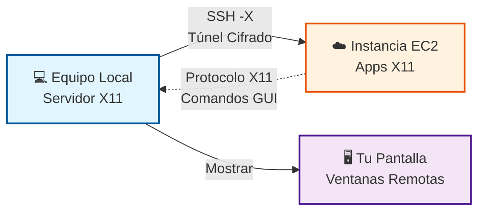
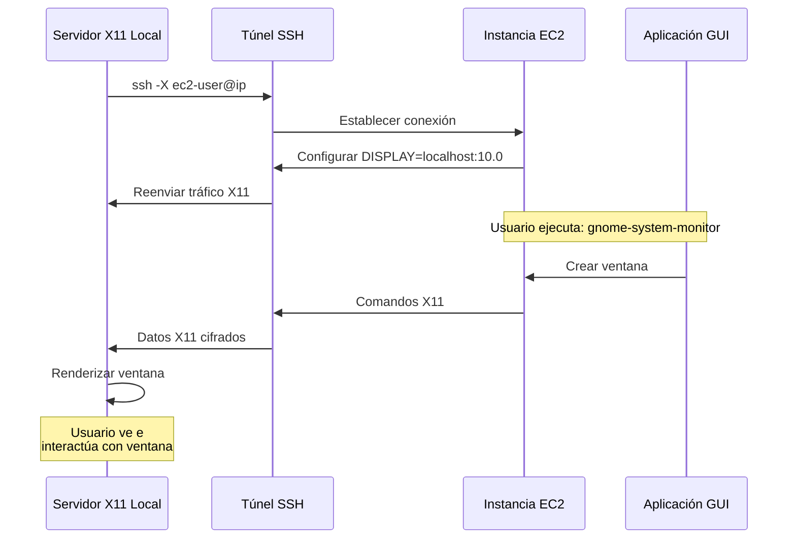

# Caso 3: El Escritorio Invisible

## 🎯 Objetivo

Demostrar cómo ejecutar aplicaciones gráficas remotamente y visualizarlas en tu máquina local usando X11 forwarding sobre SSH.

## 📋 Concepto

Ejecutar aplicaciones GUI en una instancia EC2 de AWS mientras las visualizas e interactúas con ellas en tu pantalla local, sin VNC ni RDP.

## 🔧 Técnicas SSH Demostradas

- **X11 Forwarding** (`ssh -X`): Mostrar aplicaciones gráficas remotas localmente
- **Trusted X11** (`ssh -Y`): X11 forwarding mejorado con confianza total
- **Compatibilidad multiplataforma**: Funciona en Linux, Windows y macOS

## 🏗️ Arquitectura

1. **Equipo Local**
   - Ejecuta servidor X11 (X.Org en Linux, VcXsrv en Windows, XQuartz en macOS)
   - Conecta a EC2 con X11 forwarding habilitado
   - Muestra ventanas de aplicaciones remotas localmente

2. **Instancia EC2 AWS**
   - t2.micro con Amazon Linux 2023
   - Librerías y aplicaciones X11 instaladas
   - SSH configurado con X11Forwarding habilitado
   - Ejecuta aplicaciones GUI que aparecen en pantalla del cliente



## 🚀 Demostración

### 1. Desplegar Infraestructura AWS

Ve a GitHub Actions y ejecuta el workflow **Deploy Case 3 - X11 Forwarding Infrastructure**:

- **Environment**: `poc`
- **Action**: `apply`
- **AWS Region**: `eu-west-1` (o tu región preferida)
- **SSH Public Key**: Contenido de tu clave pública SSH

El workflow:

- ✅ Crea VPC con subnet pública
- ✅ Despliega instancia EC2 con paquetes X11
- ✅ Configura SSH para X11 forwarding
- ✅ Instala aplicaciones de demostración (xeyes, xclock, gnome-system-monitor)
- ✅ Muestra instrucciones de conexión

### 2. Configurar Servidor X11 Local

#### Linux

No requiere acción - el servidor X11 ya está ejecutándose.

#### Windows

**Opción 1: VcXsrv (Recomendado)**

```powershell
# Descarga e instala VcXsrv
# https://sourceforge.net/projects/vcxsrv/

# Lanza XLaunch con estas configuraciones:
# - Display settings: Multiple windows
# - Start no client
# - Extra settings: Disable access control ✓

# Configura variable DISPLAY en PowerShell
$env:DISPLAY="localhost:0.0"
```

**Opción 2: MobaXterm (Más Fácil)**

```text
1. Descarga MobaXterm: https://mobaxterm.mobatek.net/
2. Servidor X11 integrado se activa automáticamente
3. Crea sesión SSH con X11-Forwarding habilitado
```

#### macOS

```bash
# Instala XQuartz
brew install --cask xquartz

# Cierra sesión y vuelve a entrar
# XQuartz debe estar ejecutándose antes de la conexión SSH
```

### 3. Conectar con X11 Forwarding

```bash
# Reemplaza con la IP de tu EC2 y ruta de clave SSH
ssh -X -i ~/.ssh/your-key.pem ec2-user@<EC2_PUBLIC_IP>
```

**Para X11 confiable (más permisivo):**

```bash
ssh -Y -i ~/.ssh/your-key.pem ec2-user@<EC2_PUBLIC_IP>
```

### 4. Probar X11 Forwarding

#### Prueba Simple (30 segundos)

```bash
# Ojos que siguen tu cursor
xeyes
```

**Esperado**: Una ventana con ojos aparece en tu pantalla local, siguiendo los movimientos del ratón.

#### Terminal X11 (Demo Principal)

```bash
# Terminal X11 - ejecuta cualquier comando con salida gráfica
xterm

# Dentro de xterm, puedes:
ls /etc
cat /home/ec2-user/welcome.txt
htop  # si está instalado
```

**Esperado**: Ventana de terminal se abre en tu pantalla local. Los comandos se ejecutan en **EC2 remota**, mostrando sistema de archivos remoto. Puedes abrir múltiples ventanas xterm simultáneamente.

```bash
# Monitor de Sistema GNOME
gnome-system-monitor
```

**Esperado**: Aplicación completa de monitor del sistema mostrando:

- Gráficos de uso de CPU
- Consumo de memoria
- Lista de procesos
- Actividad de red

**¡Todo ejecutándose en EC2, mostrado en tu pantalla!**

### 5. Cómo Funciona



## 📦 Recursos Necesarios

**AWS:**

- 1× VPC (10.0.0.0/16)
- 1× Subnet Pública
- 1× Internet Gateway
- 1× EC2 t2.micro (Amazon Linux 2023)
- 1× IP Elástica
- 1× Security Group (SSH:22)


## 🔒 Consideraciones de Seguridad

### X11 Forwarding vs X11 Trusted

**`ssh -X` (Más Seguro)**

- Usa Extensión de Seguridad X11
- Restringe lo que las apps remotas pueden hacer
- Recomendado para servidores no confiables

**`ssh -Y` (Más Permisivo)**

- Deshabilita restricciones de seguridad X11
- Apps remotas tienen acceso total al servidor X
- Usar solo para servidores confiables

### Mejores Prácticas

1. **Habilitar X11 forwarding solo cuando sea necesario**
2. **Usar `-X` en lugar de `-Y` por defecto**
3. **Mantener servidor X11 actualizado** (XQuartz, VcXsrv, etc.)
4. **No exponer servidor X11 a la red** (solo localhost)

## 🧹 Limpieza

Destruye la infraestructura al terminar:

```bash
# Vía workflow de GitHub Actions
# Environment: poc
# Action: destroy
```

O manualmente:

```bash
cd 04-x11-forwarding/terraform
terraform destroy -auto-approve
```

## 🎓 Resultados de Aprendizaje

Después de esta demostración, los asistentes entenderán:

1. **Fundamentos del Protocolo X11**
   - Cómo funciona la arquitectura cliente-servidor X11
   - Diferencia entre servidor X y cliente X

2. **SSH X11 Forwarding**
   - Cómo SSH tuneliza tráfico X11 de forma segura
   - Variable DISPLAY y reenvío de puertos (localhost:10.0)

3. **Compatibilidad Multiplataforma**
   - Configurar X11 en Windows/macOS/Linux
   - Herramientas y configuraciones específicas de plataforma

4. **Casos de Uso Reales**
   - Herramientas de administración GUI remotas
   - Ejecutar aplicaciones gráficas en servidores sin cabeza
   - Acceder a apps GUI desde instancias cloud
   - Entornos de desarrollo con IDEs remotos

## 📚 Recursos Adicionales

- [Documentación X11 Forwarding](https://wiki.archlinux.org/title/OpenSSH#X11_forwarding)
- [XQuartz para macOS](https://www.xquartz.org/)
- [VcXsrv para Windows](https://sourceforge.net/projects/vcxsrv/)
- [MobaXterm](https://mobaxterm.mobatek.net/)
