# Dynamic SOCKS Proxy with SSH

## 📋 Introduction

A **dynamic SOCKS proxy** with SSH allows you to create a proxy server on your local machine that redirects all traffic through a remote SSH server. It's like having a mini-VPN per application.

## 🎯 Concept

When you create a dynamic SSH tunnel, SSH acts as a **SOCKS5 server** on your local machine. Any application that supports SOCKS proxies can send its traffic through this tunnel, and the remote SSH server will be the one making the actual connections.

```mermaid
graph LR
    A[💻 Local Application<br/>Firefox, curl, etc.] -->|SOCKS5<br/>localhost:8080| B[🔒 SSH Client<br/>Encrypted Tunnel]
    B -->|SSH Encrypted| C[☁️ Remote SSH Server]
    C -->|Real Connection| D[🌐 Internet<br/>Websites, APIs]
    
    style A fill:#e1f5ff,stroke:#01579b,stroke-width:2px
    style B fill:#fff3e0,stroke:#e65100,stroke-width:2px
    style C fill:#f3e5f5,stroke:#4a148c,stroke-width:2px
    style D fill:#e8f5e9,stroke:#2e7d32,stroke-width:2px
```



## 🚀 Basic Command

```bash
ssh -D 8080 user@remote-server
```

**Parameters:**

- `-D 8080`: Creates a SOCKS server on local port 8080
- `user@remote-server`: Your SSH server

**Full recommended command:**

```bash
ssh -D 8080 -C -N -f user@remote-server
```

**Additional options:**

- `-C`: Data compression (faster connection)
- `-N`: Don't execute remote commands (tunnel only)
- `-f`: Send to background (frees up terminal)

## 💡 Practical Use Cases

### 1. Secure Browsing on Public Networks

**Scenario:** Working from an airport or coffee shop with public WiFi.

```bash
# Connect to SSH server with SOCKS proxy
ssh -D 8080 -C -N -f user@your-secure-server.com

# Verify the tunnel is active
ps aux | grep "ssh -D"
```

**Benefit:** All your web traffic is encrypted to your server, preventing anyone on the public network from intercepting it (man-in-the-middle attacks).

### 2. Access to Corporate Internal Network Resources

**Scenario:** You need to access internal servers, databases, or intranet from home.

```bash
# Connect to server inside corporate network
ssh -D 1080 user@bastion.company.com

# Now you can access internal services
# by configuring your applications to use localhost:1080
```

**Benefit:** Access to all internal resources as if you were physically at the office, without setting up a full VPN.

### 3. Bypass Geographic Restrictions

**Scenario:** Test how your application looks from different countries.

```bash
# Connect to server in another country
ssh -D 9050 user@server-in-europe.com
```

**Benefit:** Your traffic appears to come from the country where your SSH server is located.

### 4. Development and Testing

**Scenario:** Test APIs or services from the production server perspective.

```bash
# Connect to production server
ssh -D 8080 user@production.company.com

# Make requests through the proxy
curl --socks5 localhost:8080 https://internal-api.company.com/health
```

## 🔧 Application Configuration

### Firefox

**Manual configuration:**

1. Open Firefox
2. Go to **Preferences** → **General** → **Network Settings** → **Settings**
3. Select **Manual proxy configuration**
4. Configure:
   - **SOCKS Host:** `localhost`
   - **Port:** `8080`
   - **SOCKS v5:** ✓ (enabled)
   - **Proxy DNS when using SOCKS v5:** ✓ (enabled)
5. OK

**Verify it works:**

```bash
# Create the tunnel
ssh -D 8080 -C -N user@server.com

# In Firefox, visit:
https://ifconfig.me
# Should show your remote server's IP, not your local IP
```

### Chrome/Chromium

Chrome doesn't have integrated proxy configuration, it uses the operating system's or can be launched with parameters:

```bash
# Linux
google-chrome --proxy-server="socks5://localhost:8080"

# macOS
"/Applications/Google Chrome.app/Contents/MacOS/Google Chrome" \
  --proxy-server="socks5://localhost:8080"

# Windows
"C:\Program Files\Google\Chrome\Application\chrome.exe" \
  --proxy-server="socks5://localhost:8080"
```

### curl

```bash
# Request through SOCKS proxy
curl --socks5 localhost:8080 http://example.com

# See your public IP through the proxy
curl --socks5 localhost:8080 https://ifconfig.me

# With HTTP authentication
curl --socks5 localhost:8080 -u user:password https://api.example.com
```

### wget

```bash
# Configure SOCKS proxy in ~/.wgetrc
echo "use_proxy = on" >> ~/.wgetrc
echo "http_proxy = socks5://localhost:8080" >> ~/.wgetrc
echo "https_proxy = socks5://localhost:8080" >> ~/.wgetrc

# Or use environment variable
export http_proxy=socks5://localhost:8080
export https_proxy=socks5://localhost:8080

wget http://example.com
```

### Git

```bash
# Configure Git to use SOCKS proxy
git config --global http.proxy socks5://localhost:8080
git config --global https.proxy socks5://localhost:8080

# Clone repository through proxy
git clone https://github.com/user/repo.git

# Disable proxy
git config --global --unset http.proxy
git config --global --unset https.proxy
```

### Database Clients

**DBeaver:**

1. Create new connection
2. In **Network** → **Proxy** → **SOCKS**
3. Host: `localhost`, Port: `8080`

**MySQL Workbench:**

1. Go to **Edit** → **Preferences** → **Others** → **Proxy**
2. Configure SOCKS proxy: `localhost:8080`

## 🔍 Advanced Case: ProxyChains

For applications that don't natively support SOCKS:

### Installation

```bash
# Ubuntu/Debian
sudo apt-get install proxychains4

# Fedora/RHEL
sudo dnf install proxychains-ng

# macOS
brew install proxychains-ng
```

### Configuration

```bash
# Edit configuration file
sudo nano /etc/proxychains4.conf

# Comment out the line:
# dynamic_chain

# Uncomment:
strict_chain

# At the end of file, add:
[ProxyList]
socks5 127.0.0.1 8080
```

### Usage

```bash
# 1. Create SOCKS tunnel
ssh -D 8080 -C -N -f user@server.com

# 2. Execute any command through the proxy
proxychains4 nmap -sT 192.168.1.0/24
proxychains4 telnet internal-server.company.com 23
proxychains4 mysql -h internal-db-server -u user -p

# 3. Execute GUI applications
proxychains4 firefox
proxychains4 thunderbird
```

## 📊 Comparison with Other Methods

| Feature | SOCKS Proxy SSH | Full VPN | SSH Port Forwarding | HTTP Proxy |
|---------|-----------------|----------|---------------------|------------|
| **Setup** | Simple (one command) | Complex (client software) | Simple | Simple |
| **Flexibility** | Per application | All traffic | Specific ports only | Per application |
| **Speed** | High | Medium-High | High | High |
| **Security** | High (SSH encrypted) | High | High (SSH encrypted) | Low (no encryption) |
| **Granularity** | Per application | Entire system | Per port | Per application |
| **Protocols** | All TCP protocols | All | Specific | HTTP/HTTPS only |
| **DNS Leaks** | Protected if configured | Protected | N/A | Vulnerable |

## 🔐 Security and Best Practices

### 1. Protect Against DNS Leaks

```bash
# Use remote server's DNS
# In Firefox: enable "Proxy DNS when using SOCKS v5"

# On Linux, configure temporary resolv.conf
sudo nano /etc/resolv.conf
# nameserver 8.8.8.8
```

### 2. Verify Proxy Works

```bash
# See IP without proxy
curl https://ifconfig.me

# Create tunnel
ssh -D 8080 -C -N -f user@server.com

# See IP with proxy
curl --socks5 localhost:8080 https://ifconfig.me

# Should be different IPs
```

### 3. Kill Old Tunnels

```bash
# See SSH processes with SOCKS tunnel
ps aux | grep "ssh -D"

# Kill specific process
kill <PID>

# Kill all SSH tunnels
pkill -f "ssh -D"
```

### 4. Timeouts and Keepalives

```bash
# Keep connection alive
ssh -D 8080 -C -N \
    -o ServerAliveInterval=60 \
    -o ServerAliveCountMax=3 \
    user@server.com
```

## 🤖 Automation with systemd

### Create Persistent Service

```bash
# Create service file
sudo nano /etc/systemd/system/ssh-socks-proxy.service
```

```ini
[Unit]
Description=SSH SOCKS Proxy
After=network-online.target
Wants=network-online.target

[Service]
Type=simple
User=youruser
# Use SSH key without password
ExecStart=/usr/bin/ssh -D 8080 -C -N -o ServerAliveInterval=60 user@server.com
Restart=always
RestartSec=5
StandardOutput=journal
StandardError=journal

[Install]
WantedBy=multi-user.target
```

### Enable and Manage

```bash
# Reload systemd
sudo systemctl daemon-reload

# Start service
sudo systemctl start ssh-socks-proxy

# Check status
sudo systemctl status ssh-socks-proxy

# Enable at boot
sudo systemctl enable ssh-socks-proxy

# View logs
sudo journalctl -u ssh-socks-proxy -f
```

## 📝 SSH Configuration (~/.ssh/config)

Simplify long commands:

```bash
# Edit ~/.ssh/config
nano ~/.ssh/config
```

```text
Host socks-proxy
    HostName server.company.com
    User user
    DynamicForward 8080
    Compression yes
    ServerAliveInterval 60
    ServerAliveCountMax 3
```

Now you can connect simply with:

```bash
ssh -N -f socks-proxy
```

## 🐛 Troubleshooting

### Problem: Port already in use

```bash
# Error: bind: Address already in use

# See which process uses the port
sudo lsof -i :8080

# Or use netstat
netstat -tuln | grep 8080

# Use another port
ssh -D 8081 user@server.com
```

### Problem: Very slow connection

```bash
# Enable compression
ssh -D 8080 -C user@server.com

# Reduce encryption (less secure but faster)
ssh -D 8080 -c aes128-ctr user@server.com
```

### Problem: Tunnel drops constantly

```bash
# Enable keepalives
ssh -D 8080 \
    -o ServerAliveInterval=30 \
    -o ServerAliveCountMax=5 \
    -o TCPKeepAlive=yes \
    user@server.com
```

### Problem: DNS doesn't resolve correctly

```bash
# Verify browser configuration
# Firefox: "Proxy DNS when using SOCKS v5" must be enabled

# Test resolution
dig @8.8.8.8 example.com

# Use ProxyChains with proxy_dns enabled
# In /etc/proxychains.conf:
# proxy_dns
```

## 🔗 Differences with Port Forwarding

**Local Port Forwarding (-L):**

```bash
# Redirects a specific port
ssh -L 3306:db-server:3306 user@bastion.com
# You can only connect to MySQL on localhost:3306
```

**Remote Port Forwarding (-R):**

```bash
# Exposes your local port on remote server
ssh -R 8080:localhost:80 user@server.com
# Your local:80 service accessible on server:8080
```

**SOCKS Proxy (-D):**

```bash
# Dynamic proxy for any destination
ssh -D 8080 user@server.com
# You can connect to ANY destination by configuring your app
```

**When to use each:**

- **-L**: You know exactly which service you need (e.g., specific database)
- **-R**: You want to expose your local service to the outside
- **-D**: You need flexible access to multiple services or web browsing

## 📚 Enterprise Use Cases

### 1. Temporary Access to Corporate Network

```bash
# Without installing corporate VPN
ssh -D 8080 user@vpn-gateway.company.com

# Access internal resources
curl --socks5 localhost:8080 http://jenkins.intranet
curl --socks5 localhost:8080 http://wiki.intranet
```

### 2. API Testing from Different Locations

```bash
# Server in US
ssh -D 8080 user@server-us.company.com
curl --socks5 localhost:8080 https://api.example.com/geoip

# Server in Europe
ssh -D 8081 user@server-eu.company.com
curl --socks5 localhost:8081 https://api.example.com/geoip
```

### 3. Security Auditing

```bash
# Tunnel through secure server
ssh -D 8080 auditor@audit-server.com

# Scan internal network
proxychains4 nmap -sT internal-network.company.com

# Analyze traffic
proxychains4 wireshark
```

## 🎓 Summary

**Dynamic SOCKS Proxy with SSH is ideal for:**

- ✅ Secure browsing on untrusted networks
- ✅ Flexible access to multiple services
- ✅ Testing from different locations
- ✅ Temporary access without VPN
- ✅ Per application, not entire system

**Not ideal for:**

- ❌ Video streaming (full VPN better)
- ❌ Requires a lot of bandwidth (SSH overhead)
- ❌ Applications that don't support SOCKS

## 📖 Additional References

- [SSH Manual: Dynamic Port Forwarding](https://man.openbsd.org/ssh#D)
- [SOCKS Protocol Specification](https://datatracker.ietf.org/doc/html/rfc1928)
- [ProxyChains Documentation](https://github.com/haad/proxychains)

---

**See also:**

- [AutoSSH Configuration](README_autossh.md)
- [SSH Tips and Tricks](README_tips.md)
- [Jailed Users for Tunnels](README_jailed_user_tunnel.md)
