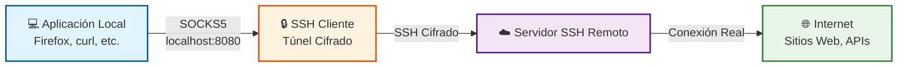

# SOCKS Proxy Dinámico con SSH

## 📋 Introducción

Un **SOCKS Proxy dinámico** con SSH te permite crear un servidor proxy en tu máquina local que redirige todo el tráfico a través de un servidor SSH remoto. Es como tener una mini-VPN por aplicación.

## 🎯 Concepto

Cuando creas un túnel SSH dinámico, SSH actúa como un **servidor SOCKS5** en tu máquina local. Cualquier aplicación que soporte proxies SOCKS puede enviar su tráfico a través de este túnel, y el servidor SSH remoto será quien realice las conexiones reales.



## 🚀 Comando Básico

```bash
ssh -D 8080 usuario@servidor-remoto
```

**Parámetros:**

- `-D 8080`: Crea un servidor SOCKS en el puerto local 8080
- `usuario@servidor-remoto`: Tu servidor SSH

**Comando completo recomendado:**

```bash
ssh -D 8080 -C -N -f usuario@servidor-remoto
```

**Opciones adicionales:**

- `-C`: Compresión de datos (conexión más rápida)
- `-N`: No ejecutar comandos remotos (solo túnel)
- `-f`: Enviar a background (libera la terminal)

## 💡 Casos de Uso Prácticos

### 1. Navegación Segura en Redes Públicas

**Escenario:** Trabajando desde un aeropuerto o cafetería con WiFi público.

```bash
# Conectar al servidor SSH con SOCKS proxy
ssh -D 8080 -C -N -f usuario@tu-servidor-seguro.com

# Verificar que el túnel está activo
ps aux | grep "ssh -D"
```

**Beneficio:** Todo tu tráfico web va cifrado hasta tu servidor, evitando que alguien en la red pública pueda interceptarlo (ataques man-in-the-middle).

### 2. Acceso a Recursos Internos de Red Corporativa

**Escenario:** Necesitas acceder a servidores internos, bases de datos o intranet desde casa.

```bash
# Conectar al servidor dentro de la red corporativa
ssh -D 1080 usuario@bastion.empresa.com

# Ahora puedes acceder a servicios internos
# configurando tus aplicaciones para usar localhost:1080
```

**Beneficio:** Acceso a todos los recursos internos como si estuvieras físicamente en la oficina, sin configurar VPN completa.

### 3. Bypass de Restricciones Geográficas

**Escenario:** Probar cómo se ve tu aplicación desde diferentes países.

```bash
# Conectar a servidor en otro país
ssh -D 9050 usuario@servidor-en-europa.com
```

**Beneficio:** Tu tráfico aparece como si viniera del país donde está tu servidor SSH.

### 4. Desarrollo y Testing

**Escenario:** Probar APIs o servicios desde la perspectiva del servidor de producción.

```bash
# Conectar al servidor de producción
ssh -D 8080 usuario@produccion.empresa.com

# Hacer peticiones a través del proxy
curl --socks5 localhost:8080 https://api-interna.empresa.com/health
```

## 🔧 Configuración de Aplicaciones

### Firefox

**Configuración manual:**

1. Abrir Firefox
2. Ir a **Preferencias** → **General** → **Configuración de red** → **Ajustes**
3. Seleccionar **Configuración manual del proxy**
4. Configurar:
   - **Servidor SOCKS:** `localhost`
   - **Puerto:** `8080`
   - **SOCKS v5:** ✓ (activado)
   - **Proxy DNS al usar SOCKS v5:** ✓ (activado)
5. Aceptar

**Verificar que funciona:**

```bash
# Crear el túnel
ssh -D 8080 -C -N usuario@servidor.com

# En Firefox, visitar:
https://ifconfig.me
# Debería mostrar la IP de tu servidor remoto, no tu IP local
```

### Chrome/Chromium

Chrome no tiene configuración de proxy integrada, usa la del sistema operativo o se puede lanzar con parámetros:

```bash
# Linux
google-chrome --proxy-server="socks5://localhost:8080"

# macOS
"/Applications/Google Chrome.app/Contents/MacOS/Google Chrome" \
  --proxy-server="socks5://localhost:8080"

# Windows
"C:\Program Files\Google\Chrome\Application\chrome.exe" \
  --proxy-server="socks5://localhost:8080"
```

### curl

```bash
# Petición a través del proxy SOCKS
curl --socks5 localhost:8080 http://ejemplo.com

# Ver tu IP pública a través del proxy
curl --socks5 localhost:8080 https://ifconfig.me

# Con autenticación HTTP
curl --socks5 localhost:8080 -u usuario:password https://api.ejemplo.com
```

### wget

```bash
# Configurar proxy SOCKS en ~/.wgetrc
echo "use_proxy = on" >> ~/.wgetrc
echo "http_proxy = socks5://localhost:8080" >> ~/.wgetrc
echo "https_proxy = socks5://localhost:8080" >> ~/.wgetrc

# O usar variable de entorno
export http_proxy=socks5://localhost:8080
export https_proxy=socks5://localhost:8080

wget http://ejemplo.com
```

### Git

```bash
# Configurar Git para usar proxy SOCKS
git config --global http.proxy socks5://localhost:8080
git config --global https.proxy socks5://localhost:8080

# Clonar repositorio a través del proxy
git clone https://github.com/usuario/repo.git

# Desactivar proxy
git config --global --unset http.proxy
git config --global --unset https.proxy
```

### Clientes de Base de Datos

**DBeaver:**

1. Crear nueva conexión
2. En **Red** → **Proxy** → **SOCKS**
3. Host: `localhost`, Puerto: `8080`

**MySQL Workbench:**

1. Ir a **Edit** → **Preferences** → **Others** → **Proxy**
2. Configurar SOCKS proxy: `localhost:8080`

## 🔍 Caso Avanzado: ProxyChains

Para aplicaciones que no soportan SOCKS nativamente:

### Instalación

```bash
# Ubuntu/Debian
sudo apt-get install proxychains4

# Fedora/RHEL
sudo dnf install proxychains-ng

# macOS
brew install proxychains-ng
```

### Configuración

```bash
# Editar archivo de configuración
sudo nano /etc/proxychains4.conf

# Comentar la línea:
# dynamic_chain

# Descomentar:
strict_chain

# Al final del archivo, agregar:
[ProxyList]
socks5 127.0.0.1 8080
```

### Uso

```bash
# 1. Crear el túnel SOCKS
ssh -D 8080 -C -N -f usuario@servidor.com

# 2. Ejecutar cualquier comando a través del proxy
proxychains4 nmap -sT 192.168.1.0/24
proxychains4 telnet servidor-interno.empresa.com 23
proxychains4 mysql -h db-servidor-interno -u usuario -p

# 3. Ejecutar aplicaciones GUI
proxychains4 firefox
proxychains4 thunderbird
```

## 📊 Comparación con Otros Métodos

| Característica | SOCKS Proxy SSH | VPN Completa | Port Forwarding SSH | Proxy HTTP |
|---------------|-----------------|--------------|---------------------|------------|
| **Configuración** | Simple (un comando) | Compleja (software cliente) | Simple | Simple |
| **Flexibilidad** | Por aplicación | Todo el tráfico | Solo puertos específicos | Solo HTTP/HTTPS |
| **Velocidad** | Alta | Media-Alta | Alta | Alta |
| **Seguridad** | Alta (SSH cifrado) | Alta | Alta (SSH cifrado) | Baja (sin cifrado) |
| **Granularidad** | Por aplicación | Todo el sistema | Por puerto | Por aplicación |
| **Protocolos** | Todos los protocolos TCP | Todos | Específicos | Solo HTTP/HTTPS |
| **DNS Leaks** | Protegido si se configura | Protegido | N/A | Vulnerable |

## 🔐 Seguridad y Mejores Prácticas

### 1. Proteger contra DNS Leaks

```bash
# Usar servidor DNS del servidor remoto
# En Firefox: activar "Proxy DNS al usar SOCKS v5"

# En Linux, configurar resolv.conf temporal
sudo nano /etc/resolv.conf
# nameserver 8.8.8.8
```

### 2. Verificar que el Proxy Funciona

```bash
# Ver IP sin proxy
curl https://ifconfig.me

# Crear túnel
ssh -D 8080 -C -N -f usuario@servidor.com

# Ver IP con proxy
curl --socks5 localhost:8080 https://ifconfig.me

# Deberían ser diferentes IPs
```

### 3. Matar Túneles Antiguos

```bash
# Ver procesos SSH con túnel SOCKS
ps aux | grep "ssh -D"

# Matar proceso específico
kill <PID>

# Matar todos los túneles SSH
pkill -f "ssh -D"
```

### 4. Timeouts y Keepalives

```bash
# Mantener conexión activa
ssh -D 8080 -C -N \
    -o ServerAliveInterval=60 \
    -o ServerAliveCountMax=3 \
    usuario@servidor.com
```

## 🤖 Automatización con systemd

### Crear Servicio Persistente

```bash
# Crear archivo de servicio
sudo nano /etc/systemd/system/ssh-socks-proxy.service
```

```ini
[Unit]
Description=SSH SOCKS Proxy
After=network-online.target
Wants=network-online.target

[Service]
Type=simple
User=tuusuario
# Usar clave SSH sin password
ExecStart=/usr/bin/ssh -D 8080 -C -N -o ServerAliveInterval=60 usuario@servidor.com
Restart=always
RestartSec=5
StandardOutput=journal
StandardError=journal

[Install]
WantedBy=multi-user.target
```

### Activar y Gestionar

```bash
# Recargar systemd
sudo systemctl daemon-reload

# Iniciar servicio
sudo systemctl start ssh-socks-proxy

# Verificar estado
sudo systemctl status ssh-socks-proxy

# Habilitar al inicio
sudo systemctl enable ssh-socks-proxy

# Ver logs
sudo journalctl -u ssh-socks-proxy -f
```

## 📝 Configuración SSH (~/.ssh/config)

Simplificar comandos largos:

```bash
# Editar ~/.ssh/config
nano ~/.ssh/config
```

```text
Host socks-proxy
    HostName servidor.empresa.com
    User usuario
    DynamicForward 8080
    Compression yes
    ServerAliveInterval 60
    ServerAliveCountMax 3
```

Ahora puedes conectar simplemente con:

```bash
ssh -N -f socks-proxy
```

## 🐛 Troubleshooting

### Problema: Puerto ya en uso

```bash
# Error: bind: Address already in use

# Ver qué proceso usa el puerto
sudo lsof -i :8080

# O usar netstat
netstat -tuln | grep 8080

# Usar otro puerto
ssh -D 8081 usuario@servidor.com
```

### Problema: Conexión muy lenta

```bash
# Activar compresión
ssh -D 8080 -C usuario@servidor.com

# Reducir cifrado (menos seguro pero más rápido)
ssh -D 8080 -c aes128-ctr usuario@servidor.com
```

### Problema: Túnel se cae constantemente

```bash
# Activar keepalives
ssh -D 8080 \
    -o ServerAliveInterval=30 \
    -o ServerAliveCountMax=5 \
    -o TCPKeepAlive=yes \
    usuario@servidor.com
```

### Problema: DNS no resuelve correctamente

```bash
# Verificar configuración del navegador
# Firefox: "Proxy DNS al usar SOCKS v5" debe estar activado

# Probar resolución
dig @8.8.8.8 ejemplo.com

# Usar ProxyChains con proxy_dns activado
# En /etc/proxychains.conf:
# proxy_dns
```

## 🔗 Diferencias con Port Forwarding

**Port Forwarding Local (-L):**

```bash
# Redirige un puerto específico
ssh -L 3306:db-server:3306 usuario@bastion.com
# Solo puedes conectar a MySQL en localhost:3306
```

**Port Forwarding Remoto (-R):**

```bash
# Expone tu puerto local en el servidor remoto
ssh -R 8080:localhost:80 usuario@servidor.com
# Tu servicio local:80 accesible en servidor:8080
```

**SOCKS Proxy (-D):**

```bash
# Proxy dinámico para cualquier destino
ssh -D 8080 usuario@servidor.com
# Puedes conectar a CUALQUIER destino configurando tu app
```

**Cuándo usar cada uno:**

- **-L**: Sabes exactamente qué servicio necesitas (ej: base de datos específica)
- **-R**: Quieres exponer tu servicio local al exterior
- **-D**: Necesitas acceso flexible a múltiples servicios o navegar web

## 📚 Casos de Uso Empresariales

### 1. Acceso Temporal a Red Corporativa

```bash
# Sin instalar VPN corporativa
ssh -D 8080 usuario@vpn-gateway.empresa.com

# Acceder a recursos internos
curl --socks5 localhost:8080 http://jenkins.intranet
curl --socks5 localhost:8080 http://wiki.intranet
```

### 2. Testing de APIs desde Diferentes Ubicaciones

```bash
# Servidor en US
ssh -D 8080 usuario@servidor-us.empresa.com
curl --socks5 localhost:8080 https://api.ejemplo.com/geoip

# Servidor en Europa
ssh -D 8081 usuario@servidor-eu.empresa.com
curl --socks5 localhost:8081 https://api.ejemplo.com/geoip
```

### 3. Auditoría de Seguridad

```bash
# Túnel a través de servidor seguro
ssh -D 8080 auditor@servidor-auditoria.com

# Escanear red interna
proxychains4 nmap -sT red-interna.empresa.com

# Analizar tráfico
proxychains4 wireshark
```

## 🎓 Resumen

**SOCKS Proxy dinámico con SSH es ideal para:**

- ✅ Navegación segura en redes no confiables
- ✅ Acceso flexible a múltiples servicios
- ✅ Testing desde diferentes ubicaciones
- ✅ Acceso temporal sin VPN
- ✅ Por aplicación, no todo el sistema

**No es ideal para:**

- ❌ Streaming de video (mejor VPN completa)
- ❌ Requiere mucho ancho de banda (overhead SSH)
- ❌ Aplicaciones que no soporten SOCKS

## 📖 Referencias Adicionales

- [SSH Manual: Dynamic Port Forwarding](https://man.openbsd.org/ssh#D)
- [SOCKS Protocol Specification](https://datatracker.ietf.org/doc/html/rfc1928)
- [ProxyChains Documentation](https://github.com/haad/proxychains)

---

**Ver también:**

- [AutoSSH Configuration](README_autossh_es.md)
- [SSH Tips and Tricks](README_tips_es.md)
- [Jailed Users for Tunnels](README_jailed_user_tunnel_es.md)
